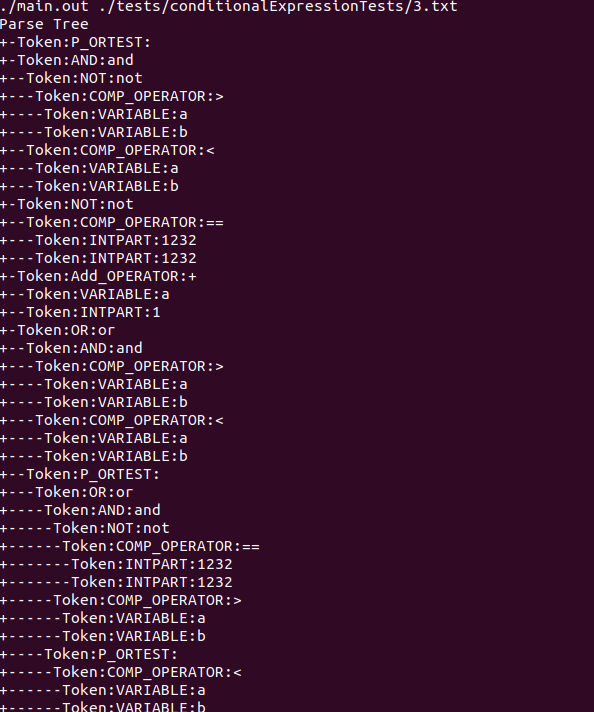

# Python Language Piece
## By: Drake Cullen and Nathan Briner

<br />


## Relevent Files for Tokenizer:
    include/ : Tokenizer.h, TokenTypes.h, TestCase.h, TokenizerTest.h, Token.h
    src/ : Token.cpp, TokenTypes.cpp, Tokenizer.cpp, TokenizerTest.cpp, TestCase.cpp, main.cpp

## Relevent Files for Parser:
    include/ : Parser.h, ParserTest.h, Result.h, 
    src/ : Parser.cpp, ParserTest.cpp, Result.cpp, main.cpp

## Relevant Files for AST:
    include/ : ASTNode.h
    src/ : ASTNode.cpp

<br />


## To run the program, run the following commands in the terminal:

<br />

Build the program:
```bash
make
```

Run tests:
```bash
make test
```

Run tests verbose:
```bash
make vtest
```

Print the Abstract Syntax Tree for a given file:
```bash
make run filename=<filename>
```

Example
```bash
make run filename=./tests/conditionalExpressionTests/3.txt
```



<br />

## Here are images of our tokenizer test cases:


<br />


## Here are images of our parser test cases:
There are 44 tests, we only provided an image of one conditional test for brevity:


All Tests Passed:
