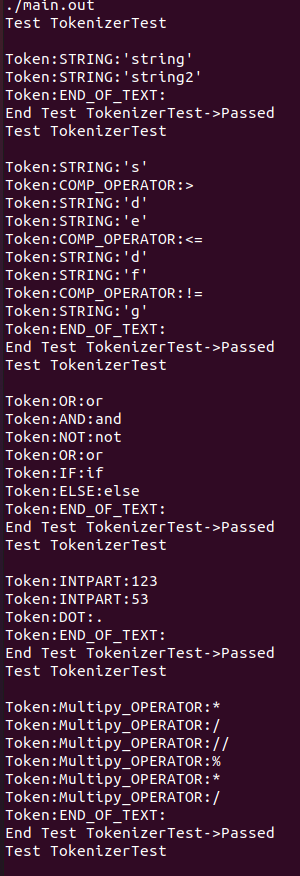
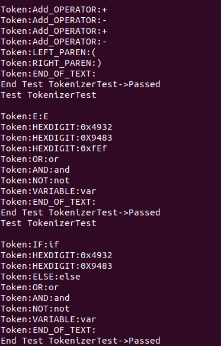

# Python Language Piece
## By: Drake Cullen and Nathan Briner

<br />


## Relevent Files for Tokenizer:
    include/ : Tokenizer.h, TokenTypes.h, TestCase.h, TokenizerTest.h, Token.h
    src/ : Token.cpp, TokenTypes.cpp, Tokenizer.cpp, TokenizerTest.cpp, TestCase.cpp, main.cpp


## To run the program, run the following command in the terminal:

<br />

```bash
make
make run
```


<br />

## Here are images of our test cases:




